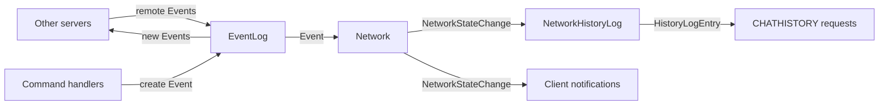

# State, Events, and History

This document explains how network state changes are represented, propagated, and stored in Sable. The design can be non-obvious at first, but each decision has a clear reason behind it.

---

## Network State

The entire state of the network at any point in time is held in the `Network` type. This struct is **read-only** for all normal operations — it can only be modified by applying an `Event` emitted from the event log.

All objects in `Network` are plain data structs identified by a unique ID. Cross-references between objects use IDs, not pointers, so state can be serialised and transmitted between nodes without issue. Most access to network objects is through ephemeral wrapper types that provide convenient accessor methods.

---

## Events and the Event Log

An `Event` represents something that happened on the network and that results in one or more changes to network state. Events are emitted most often by command handlers, but can come from anywhere.

Because all servers emit events concurrently, there is no total ordering. Instead, each event carries an `EventClock` — the set of events that had been processed on the emitting server at the time of creation. This provides dependency information: a receiving server must process all of an event's dependencies before applying the event itself.

The `EventLog` manages two responsibilities:

1. **Outgoing events** — when the server emits an event, encode the correct dependency clock and propagate it to peers.
2. **Incoming events** — for every received event, verify that all dependencies are satisfied before delivering it to the application in a consistent linear stream.

The order of this stream will differ between servers, but all valid orderings are consistent with the declared dependency data.

---

## Eventual Consistency

Sable's network state is **eventually consistent**. Different servers may process the same set of events in different orders, passing through different intermediate states, but they all converge to the same final state.

Because of this, `Event`s must not describe granular diffs — the changes they cause depend on what has already been applied. Instead, events describe _intent_ and the `Network` type resolves conflicts deterministically.

**Example:** Two users (`foo` and `bar`) on different servers simultaneously attempt to change their nickname to `baz`. After both events are processed everywhere, `foo` wins the tiebreaker. Both of the following are valid intermediate sequences:

If `foo`'s event is applied first:
1. `foo` → `baz`
2. `bar` → `123456789` (collision resolution)

If `bar`'s event is applied first:
1. `bar` → `baz`
2. `baz` → `123456789`
3. `foo` → `baz`

Both paths produce the same final state.

---

## State Updates (`NetworkStateChange`)

Since an `Event` alone cannot describe what changed (because the changes depend on ordering), a second type — `NetworkStateChange` — is emitted by `Network` when processing each event. Zero or more of these may be produced per event.

`NetworkStateChange` values are used to:

- Notify connected clients of state changes in real time.
- Feed the in-memory history log.

---

## History

Sable maintains two history stores.

### Local (In-Memory) History

Each node keeps a time-limited history of all network events it has seen:

- A running log of `NetworkStateChange` values, each wrapped in a `HistoryLogEntry` with a local ID and metadata for message tags.
- A per-user index of entry IDs that the user is permitted to see.

This allows the server to replay recent history to any user exactly as they would have originally seen it, including all channel and private messages.

### Remote (Long-Term) History

A specialised history server stores longer-term channel history in a SQL database. When a client requests history beyond what is held in memory, the client server makes a remote request over the sync network to retrieve it.

The format differs from the in-memory log: stored messages reference content directly rather than by object ID, since the network's object retention window may have expired.

---

## Data Flow

